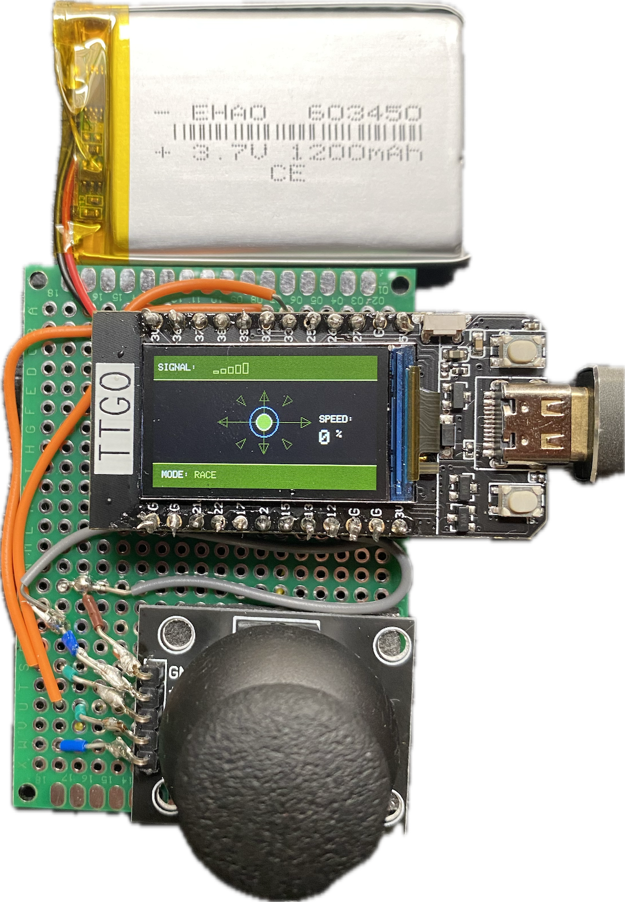
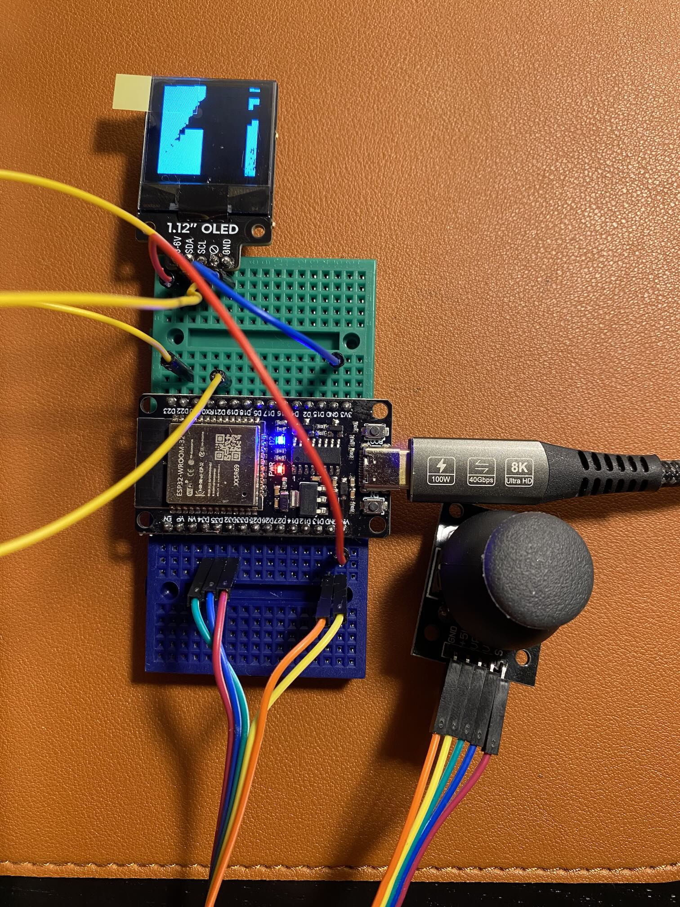
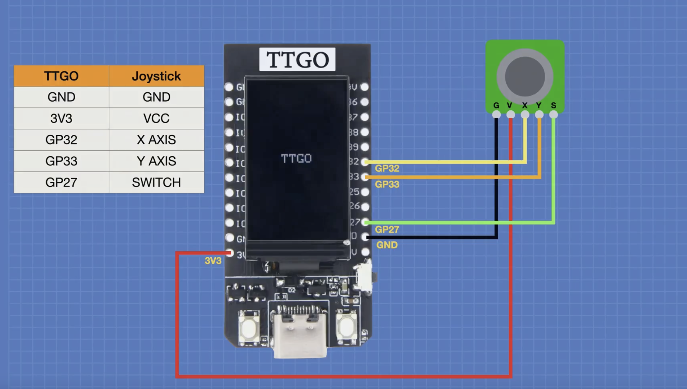

# Car controller

This project documents how to create a simple remote control to pilot an RC car that uses another ESP32 through the ESP
NOW protocol.

For the RC car related parts and code, refer to the dedicated
repo: [github.com/fpaupier/car](https://github.com/fpaupier/car)

> Note: This project is inspired from the  "_Mecanum Wheel Robot Car & ESP-NOW Remote_" video from the drone Workshop
https://www.youtube.com/watch?v=dZttHOxIoek

## Hardware - Building the controller

We use only two components, a Lilygo TTGO T-Display and an analog joystick to pilot the car. The builtin screen of the
TTGO makes it very convenient to display some infos on the joystick orientation and speed.  


_Note_: In the initial version of this controller, I tried using a small 1.12 monochrome OLED display, but it was
inconvenient to use.


### Sourcing the components

Bill of material - I actually bought the materials on those website - french resellers - (price as of March, 9th 2025)

| Component                                         | Source                                                                                                     | Price (EUR) | Quantity | Total Price (EUR) |
|---------------------------------------------------|------------------------------------------------------------------------------------------------------------|-------------|----------|-------------------|
| TTGO T-Display ESP32 LCD                          | [Passion-Radio.fr](https://www.passion-radio.fr/materiel-wifi/esp32-lilygo-895.html)                       | 13.90       | 1        | 13.90             |
| Analog Joystick                                   | [Kubii](https://www.kubii.com/fr/controleurs-actionneurs/2043-module-joystick-xy-kubii-3272496009035.html) | 2.45        | 2        | 2.45              |
| 3.7V Battery (did not managed to get it work yet) | [RF-Market.fr](https://rf-market.fr/meshtastic/1441-batterie-lipo-37v-1200mah-jst-125mm-2-broches.html)    | 5.90        | 1        | 5.90              |
| **Total**                                         |                                                                                                            |             |          | **22.25€**        |

### Wiring instruction


_Illustration from the drone workshop_

#### Wiring table

| TTGO Pin | Joystick Pin | Description                                                                                          |
|----------|--------------|------------------------------------------------------------------------------------------------------|
| GND      | GND          | Ground connection                                                                                    |
| 3V3      | +5V          | Power supply (3.3V) despite the Joystick indicating 5V, otherwise you will read erratic analog value |
| GP32     | X AXIS       | Analog input for X-axis                                                                              |
| GP33     | Y AXIS       | Analog input for Y-axis                                                                              |
| GP27     | SWITCH       | Digital input for joystick button                                                                    |

## Software - Code to run the controller

> **Prerequisite**: this project use platform IO to build the project and upload it to the ESP32. You will need to
> install,
> see [PlatformIO.org](https://platformio.org/)


### Getting the receiver MAC address

Since we use [ESP-NOW](https://docs.espressif.com/projects/esp-idf/en/stable/esp32/api-reference/network/esp_now.html)
for the two ESP32 to communicate, you need to have the MAC address of the receiver device (it's based on WiFi).
On your receiver device, you can run the snippet below to get its MAC address.

```cpp
#include <WiFi.h>

void setup() {
    Serial.begin(115200);
    WiFi.mode(WIFI_STA); // Set as WiFi station
    delay(100); // Short delay for initialization
}

void loop() {
    Serial.print("ESP32 Receiver MAC Address: ");
    Serial.println(WiFi.macAddress());
}
```

### Configuring the display library

_Tips from the Drone workshop_
The sketch we will be writing for the controller use the TFT-eSPI Library by Bodmer. We list it in as dependency in
the `platformio.ini` file.

After installing it, **you will need to modify a file in the library** to work with the TTGO T-Display. Here is how you
do
this:

1. Navigate to the `TFT_eSPI` folder in your libraries folder (which usually lives under
   your `.pio/libdeps/lilygo-t-display` folder).
2. Look for `User_Setup_Select.h` and open it
3. Comment out line 27, which reads `#include <User_Setup.h>`
4. Uncomment line 58, which reads `#include <User_Setups/Setup25_TTGO_T_Display.h>`
5. Save the file.

Once you do this, the library will work with the TTGO module!

### Source code structure

```log
car-transmitter/
├── include/
│   ├── config.h           // Configuration and constants
│   ├── joystick.h         // Joystick handling
│   ├── display.h          // Display and UI
│   ├── coms.h             // ESP-NOW communication
│   ├── secrets.h          // Here you put your receiver MAC addresses
│   └── types.h            // Shared data structures
├── src/
│   ├── main.cpp           // Main program flow
│   ├── joystick.cpp       // Joystick implementation
│   ├── display.cpp        // Display implementation
│   └── communication.cpp  // Communication implementation
```


## Gotchas

- y Axis was inverted on my analog joystick, so I had to adapt to this in my control code
- 5V of the joystick is actually plugged to the 3.3V of the esp, otherwise you have erratic measures
- to get the display working, make sure to update the ``Setup25_TTGO_T_Display`` in the TFT-eSPI Library by Bodmer
