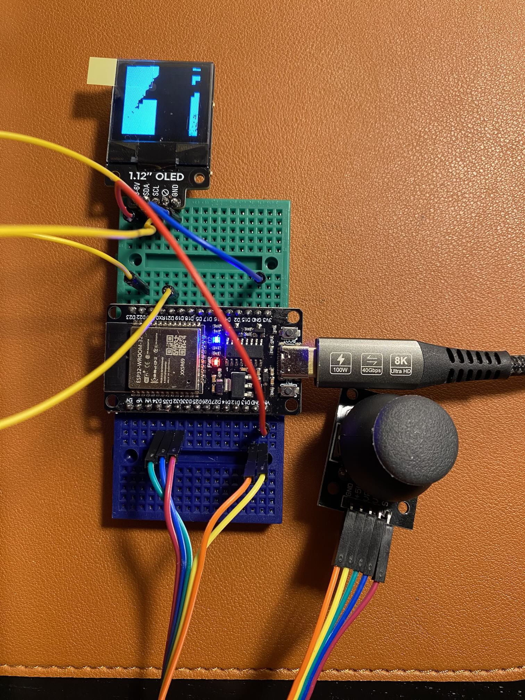

# Car Transmitter

Remote control using ESPNOW to connect to RC car

## Controller illustration

Using an analog joystick to control the car the OLED display was a tentative to show the on board camera but black and
white OLED is not useful to display camera feed, to work on that  


## Getting the receiver MAC adress

ESPNOW protocol requires the MAC address of the receiver device,
you can get it with this snippet

```cpp
#include <WiFi.h>

void setup() {
    Serial.begin(115200);
    WiFi.mode(WIFI_STA); // Set as WiFi station
    delay(100); // Short delay for initialization
}

void loop() {
    Serial.print("ESP32 Receiver MAC Address: ");
    Serial.println(WiFi.macAddress());
}
```

## TFT-eSPI Library Modifications

The sketch we will be writing for the controller will use the TFT-eSPI Library by Bodmer. You can install this library
using the Library Manager in the Arduino IDE. You might have already installed it if you followed my instructions in the
article about using Round LCD Modules, but you may need to update it, as it needs to be at least version 2.4.79 to work
with the TTGO displays.

After installing it, you will need to modify a file in the library to work with the TTGO T-Display. Here is how you do
this:

1. Navigate to the TFT_eSPI folder in your libraries folder (which usually lives under your Arduino folder).
2. Look for User_Setup_Select.h and open it with a text editor.
3. Comment out line 30, which reads `#include <User_Setup.h>`
4. Uncomment line 61, which reads `#include <User_Setups/Setup25_TTGO_T_Display.h>`
5. Save the file.

Once you do this, the library will work with the TTGO module. Source: DroneBot workshop https://dronebotworkshop.com/mecanum/